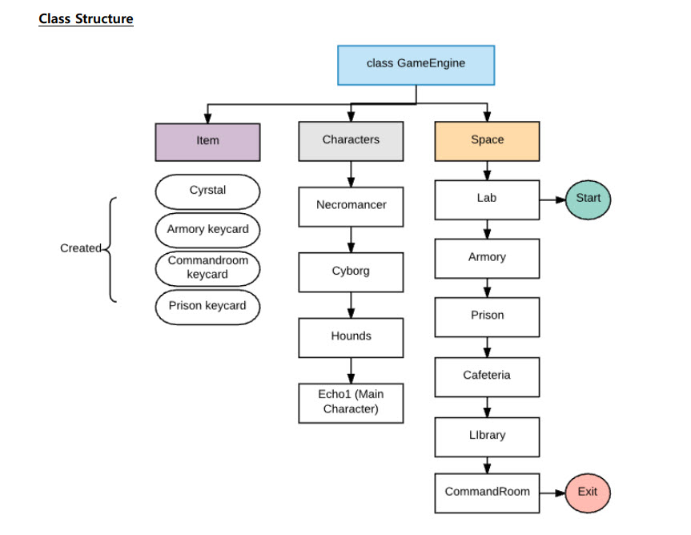
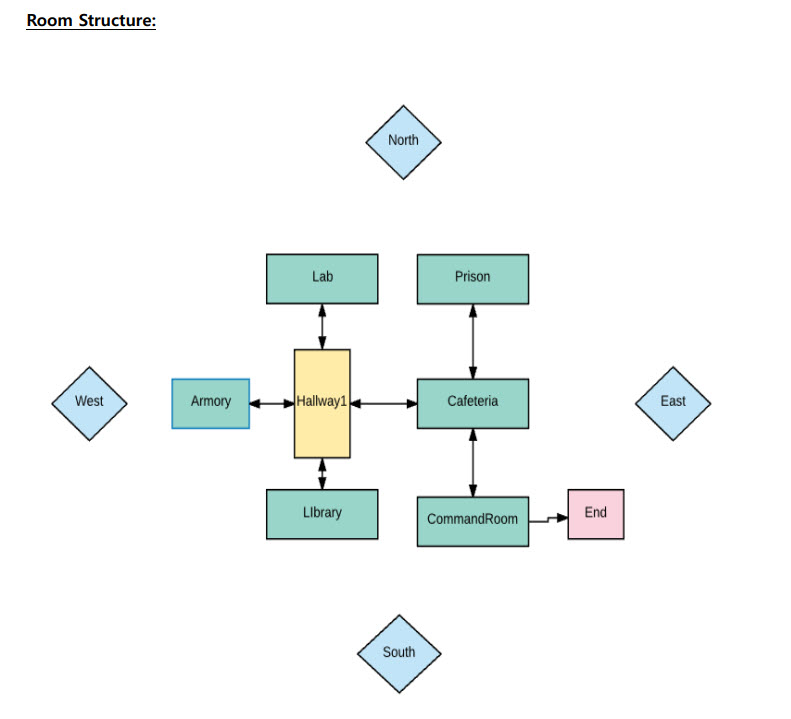

# CS 162 Final Project

### Description:

* Final project for Intro to Computer Science (CS 162). 
* The main focus was on dynamic memory allocation via pointers and object-oriented-programming design (game engine, characters, maps)

* To run: Use the make file to compile and execute

